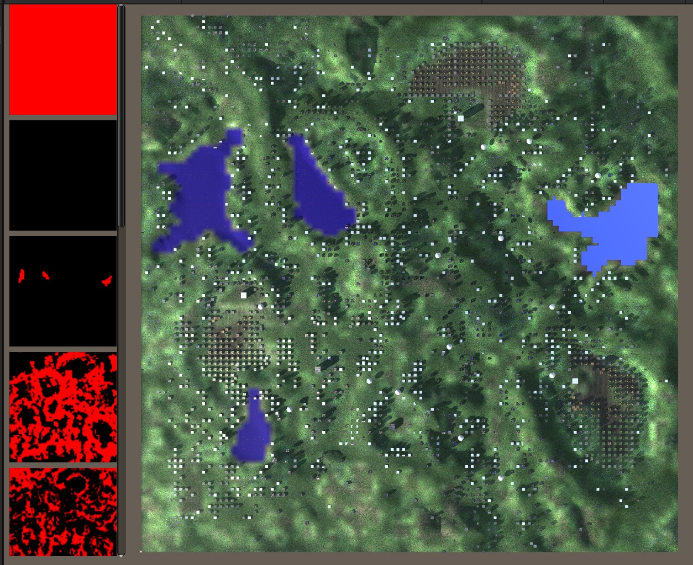
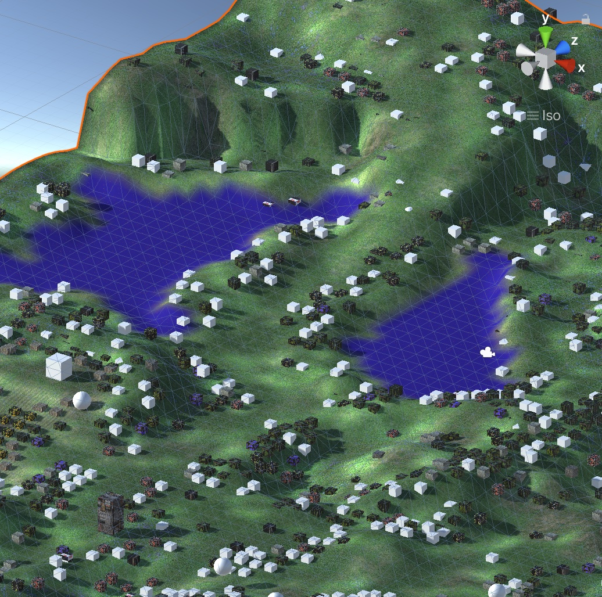
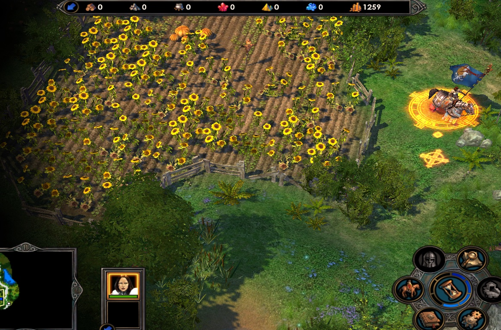

# TurnBasedStrategyGame
This project is a Unity3d playground for developing turn based strategy game, inspired by HOMM V.

Everyone is welcome to participate.

Decoded terrain layers

Decoded Game objects

Reference image

### Data content you can find in your copy of the Game
* MapObjects
* Maps				
* bin
* Textures			
* _(Skeleton)
* _(Geometry)
* _(Model)		
